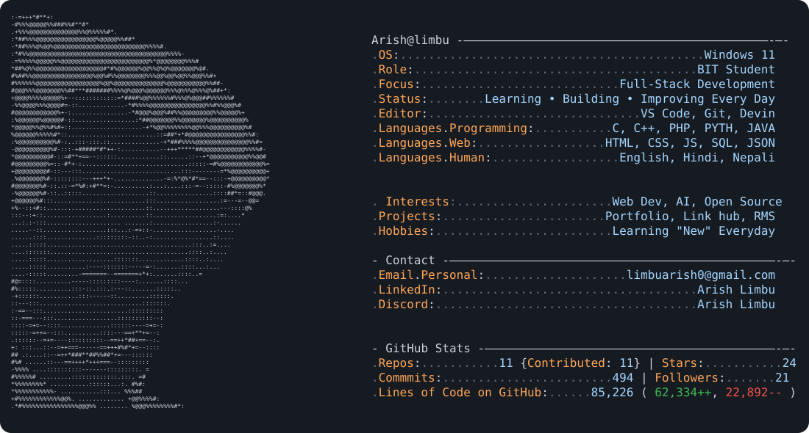

<!-- ================= ANIMATED HEADER BANNER ================= -->

 
  
  
  

<!-- ================= ABOUT ME ================= -->
  
  
  

<!-- ================= TECH STACK ================= -->
 
 
 
 

<!-- ================= GITHUB STATISTICS ================= -->

  

  
    

<!-- ================= ACTIVITY GRAPH ================= -->

 
 
 

<!-- ================= TROPHIES ================= -->

<!-- ================= CONNECT WITH ME ================= -->

    

